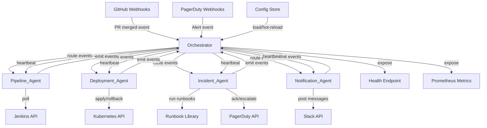
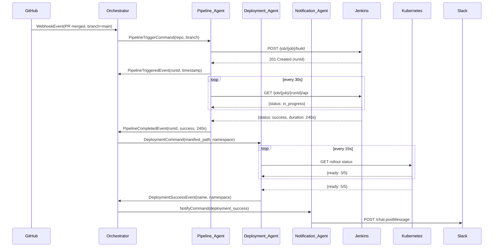

# Design Document: CRM DevOps Agents

## Overview

The CRM DevOps Agents system is an event-driven automation platform that reduces manual toil for DevOps engineers managing a CRM platform's software delivery lifecycle. It consists of four specialized agents coordinated by a central Orchestrator, collectively covering CI/CD pipeline triggering and monitoring, Kubernetes deployment management with automatic rollback, PagerDuty incident response, Slack notifications, configuration management, audit logging, and health observability.

The system follows a **hub-and-spoke** event bus pattern: the Orchestrator sits at the center, receiving inbound events from external systems (GitHub webhooks, Jenkins poll results, PagerDuty webhooks) and routing them to the appropriate agents. Agents perform their work and emit result events back to the Orchestrator, which may route those onward to other agents (e.g., deployment success → Notification_Agent).

### Key Design Goals

- **Reliability**: Every agent action is retried with exponential backoff; failures propagate explicit events rather than silently disappearing.
- **Auditability**: Every event and action is logged with a propagated correlation ID, masked credentials, and a minimum 30-day retention.
- **Operability**: A live health check endpoint and Prometheus-compatible metrics allow observability without custom tooling.
- **Configurability**: All environment-specific values live in a versioned configuration store, hot-reloaded without restarts.
- **Safety**: Automatic rollback is gated behind readiness checks; runaway automation is halted on critical failure until human review.

---

## Architecture

The system is structured as a set of loosely coupled processes communicating over an internal event bus. All components can be deployed as a single multi-threaded service (monolith) or as separate microservices behind a message broker (e.g., RabbitMQ, AWS SQS). The design uses interfaces to keep the event bus transport pluggable.



### Event Flow Example: PR Merge → Deployment



---

## Components and Interfaces

### Orchestrator

The Orchestrator is the central coordinator. Its responsibilities are:

- **Event ingestion**: Accept inbound events from external webhooks and internal agent emissions.
- **Correlation ID assignment**: Generate and attach a unique correlation ID to every inbound event before routing.
- **Routing**: Dispatch events/commands to the appropriate agent based on event type.
- **Health management**: Send heartbeats to each agent every 15 seconds; track last-response timestamps; mark agents unhealthy after 60 seconds of silence.
- **Metrics collection**: Expose a `/metrics` Prometheus endpoint aggregating per-agent counters and histograms.
- **Configuration management**: Load config at startup, validate it, and hot-reload on change within 30 seconds.

```
interface Orchestrator {
  ingest(event: InboundEvent): void
  dispatch(command: AgentCommand, target: AgentType): void
  emit(event: OutboundEvent): void
  getHealth(): HealthStatus
  getMetrics(): MetricSnapshot
  reloadConfig(): Result<void, ConfigError>
}
```

### Pipeline_Agent

Handles Jenkins/GitHub Actions pipeline lifecycle.

```
interface Pipeline_Agent {
  triggerPipeline(command: PipelineTriggerCommand): Result<PipelineRunId, TriggerError>
  pollPipelineStatus(runId: PipelineRunId): Result<PipelineStatus, PollError>
  handleCompletion(event: PipelineCompletedEvent): void
}
```

Key behaviors:
- Triggers within 60 seconds of a PR merge event.
- Retries trigger up to 3× with exponential backoff (5 s, 10 s, 20 s, capped at 60 s).
- Polls every 30 seconds; retries once after 10 s on poll failure.
- Emits timeout events when `max_duration_seconds` is exceeded.
- Retains pipeline run records for ≥ 30 days.

### Deployment_Agent

Manages Kubernetes deployments, rollouts, and rollbacks.

```
interface Deployment_Agent {
  applyManifest(command: DeploymentCommand): Result<RolloutHandle, DeployError>
  monitorRollout(handle: RolloutHandle): RolloutStatus
  initiateRollback(deployment: DeploymentRef): Result<RollbackHandle, RollbackError>
  resumeDeployment(deployment: DeploymentRef): void  // called by DevOps_Engineer
}
```

Key behaviors:
- Only applies manifests when pipeline config contains an explicit `manifest_path`.
- Polls rollout every 15 seconds; initiates automatic rollback after `rollout_timeout` (default 600 s).
- Dispatches rollback within 5 seconds; rollback must complete within 120 seconds.
- Halts automation for a `(deployment_name, namespace)` pair on critical failure until manually resumed.
- Logs every rollback attempt with timestamp, name, namespace, outcome.

### Incident_Agent

Executes runbooks in response to PagerDuty alerts.

```
interface Incident_Agent {
  handleAlert(alert: PagerDutyAlert): void
  executeRunbook(runbook: Runbook, incident: IncidentRef): Result<void, RunbookError>
  escalate(incident: IncidentRef, reason: string): void
}
```

Key behaviors:
- Responds to P1/P2 alerts only; executes latest registered runbook version within 30 seconds.
- No runbook found → Slack escalation within 30 seconds.
- Runbook timeout at 300 seconds → treated as failure → escalation.
- On success → acknowledges PagerDuty incident.

### Notification_Agent

Posts structured Slack messages.

```
interface Notification_Agent {
  postMessage(command: NotifyCommand): Result<void, NotifyError>
  resolveOnCallHandle(service: string): Result<SlackHandle, HandleError>
}
```

Key behaviors:
- Posts within 15 seconds of receiving a notify command.
- Retries Slack API failures up to 3× with exponential backoff (1 s, 2 s, 4 s, capped at 8 s).
- Every message contains: event type, orchestrator timestamp, service name, outcome.
- Incident escalations mention on-call handle; if unresolvable, posts without mention and notes unresolvability.
- Emits `NotificationDeliveryFailureEvent` after exhausting retries.

### Runbook Library

A pluggable registry of runbooks keyed by `(service_name, version)`.

```
interface RunbookLibrary {
  getLatest(serviceName: string): Option<Runbook>
  register(runbook: Runbook): void
  list(): Runbook[]
}
```

Runbooks are versioned and identified by a unique service name. The `Incident_Agent` always executes the latest registered version.

---

## Data Models

### Core Event Types

```typescript
// Base envelope wrapping every event in the system
interface BaseEvent {
  eventId: string           // UUID v4
  correlationId: string     // UUID v4, assigned by Orchestrator on ingestion
  eventType: EventType
  source: AgentType | "external"
  timestamp: ISO8601String
}

type EventType =
  | "PipelineTriggerCommand"
  | "PipelineTriggeredEvent"
  | "PipelineTriggerFailedEvent"
  | "PipelineCompletedEvent"
  | "PipelineTimeoutEvent"
  | "PipelinePollFailureEvent"
  | "DeploymentCommand"
  | "DeploymentSuccessEvent"
  | "DeploymentFailureEvent"
  | "RollbackEvent"
  | "RollbackSuccessEvent"
  | "CriticalFailureEvent"
  | "AlertReceivedEvent"
  | "IncidentResolvedEvent"
  | "IncidentEscalationEvent"
  | "IncidentExecutionFailureEvent"
  | "NotifyCommand"
  | "NotificationDeliveryFailureEvent"
  | "AgentHealthDegradedEvent"
```

### Pipeline Models

```typescript
interface PipelineTriggerCommand extends BaseEvent {
  repositoryName: string
  branchName: string
  triggerTimestamp: ISO8601String
}

interface PipelineTriggeredEvent extends BaseEvent {
  pipelineRunId: string
  repositoryName: string
  branchName: string
  triggerTimestamp: ISO8601String
}

interface PipelineTriggerFailedEvent extends BaseEvent {
  repositoryName: string
  branchName: string
  triggerTimestamp: ISO8601String
  failureReason: string
}

interface PipelineCompletedEvent extends BaseEvent {
  pipelineRunId: string
  repositoryName: string
  branchName: string
  terminalState: "success" | "failure" | "aborted"
  durationSeconds: number
}

interface PipelineTimeoutEvent extends BaseEvent {
  pipelineRunId: string
  configuredMaxDurationSeconds: number
}

interface PipelineRunRecord {
  pipelineRunId: string
  repositoryName: string
  branchName: string
  triggerTimestamp: ISO8601String
  terminalState: "success" | "failure" | "aborted" | "in_progress"
  durationSeconds: number | null
  retainUntil: ISO8601String   // triggerTimestamp + 30 days
}
```

### Deployment Models

```typescript
interface DeploymentCommand extends BaseEvent {
  manifestFilePath: string
  namespace: string
  deploymentName: string
  pipelineRunId: string  // for traceability
}

interface DeploymentSuccessEvent extends BaseEvent {
  deploymentName: string
  namespace: string
}

interface DeploymentFailureEvent extends BaseEvent {
  deploymentName: string
  namespace: string
  manifestFilePath: string
  kubernetesErrorMessage: string
}

interface RollbackEvent extends BaseEvent {
  deploymentName: string
  namespace: string
  reason: string
}

interface RollbackAttemptLog {
  timestamp: ISO8601String
  deploymentName: string
  namespace: string
  outcome: "success" | "failed" | "timed-out"
  correlationId: string
}

interface DeploymentHaltState {
  deploymentName: string
  namespace: string
  haltedAt: ISO8601String
  reason: string
  haltedUntilManualResume: true
}
```

### Incident Models

```typescript
interface PagerDutyAlert {
  incidentId: string
  serviceName: string
  severity: "P1" | "P2" | "P3" | "P4"
  receivedAt: ISO8601String
  details: Record<string, unknown>
}

interface Runbook {
  serviceName: string
  version: string              // semver string, e.g. "1.2.0"
  steps: RunbookStep[]
  timeoutSeconds: number       // must be ≤ 300
}

interface RunbookStep {
  stepId: string
  description: string
  action: RunbookAction
}

interface IncidentResolvedEvent extends BaseEvent {
  incidentId: string
  serviceName: string
}

interface IncidentEscalationEvent extends BaseEvent {
  incidentId: string
  serviceName: string
  reason: string
  onCallHandle: string | null
}

interface IncidentExecutionFailureEvent extends BaseEvent {
  incidentId: string
  serviceName: string
  failureReason: string
}
```

### Notification Models

```typescript
interface NotifyCommand extends BaseEvent {
  triggerEvent: BaseEvent      // the event that caused the notification
  eventType: EventType
  orchestratorTimestamp: ISO8601String
  affectedServiceName: string
  outcome: "success" | "failure" | "rollback" | "escalated"
  onCallHandle: string | null  // non-null for escalation events
}

interface SlackMessage {
  channel: string
  text: string
  blocks?: SlackBlock[]        // structured Slack Block Kit layout
}

interface NotificationDeliveryFailureEvent extends BaseEvent {
  targetChannel: string
  originalEventType: EventType
  failureReason: string
}
```

### Health and Observability Models

```typescript
interface HealthStatus {
  agents: AgentHealthEntry[]
  timestamp: ISO8601String
}

interface AgentHealthEntry {
  agentType: AgentType
  status: "healthy" | "unhealthy" | "unknown"
  lastHeartbeatAt: ISO8601String | null
}

interface MetricSnapshot {
  agents: AgentMetrics[]
}

interface AgentMetrics {
  agentType: AgentType
  totalEventsProcessed: number
  eventsByType: Record<EventType, number>
  actionSuccessRate: number     // 0.0 – 1.0
  actionLatencyP50Ms: number
  actionLatencyP99Ms: number
}
```

### Configuration Model

```typescript
interface SystemConfig {
  github: {
    repositories: string[]     // list of repo names to watch
    webhookSecret: string      // MASKED in logs
  }
  jenkins: {
    baseUrl: string
    apiToken: string           // MASKED in logs
    jobs: Record<string, string>  // repo → job name
  }
  kubernetes: {
    clusters: KubernetesClusterConfig[]
  }
  pagerduty: {
    apiToken: string           // MASKED in logs
    serviceRunbookMap: Record<string, string>  // service → runbook service name
  }
  slack: {
    botToken: string           // MASKED in logs
    channels: Record<EventType, string>
    onCallHandles: Record<string, string>  // service → Slack handle
  }
  pipeline: {
    maxDurationSeconds: number | null  // null = no monitoring
    rolloutTimeoutSeconds: number      // default 600
  }
}

interface KubernetesClusterConfig {
  name: string
  kubeconfig: string           // MASKED in logs
  namespaces: string[]
}
```

---

## Correctness Properties

*A property is a characteristic or behavior that should hold true across all valid executions of a system — essentially, a formal statement about what the system should do. Properties serve as the bridge between human-readable specifications and machine-verifiable correctness guarantees.*

### Property 1: Exponential Backoff Bounds (Pipeline Trigger)

*For any* sequence of trigger retry attempts, the delay between consecutive retries SHALL be greater than or equal to the previous delay and SHALL NOT exceed 60 seconds, and the total number of retry attempts SHALL NOT exceed 3.

**Validates: Requirements 1.3**

### Property 2: Pipeline Completion Event Completeness

*For any* pipeline run that transitions to a terminal state, the emitted `PipelineCompletedEvent` SHALL contain a non-null `pipelineRunId`, `repositoryName`, `branchName`, `terminalState` (one of success/failure/aborted), and a non-negative `durationSeconds`.

**Validates: Requirements 2.2**

### Property 3: Timeout Event Integrity

*For any* pipeline run where `max_duration_seconds` is configured, if the run exceeds that value, the emitted `PipelineTimeoutEvent` SHALL contain the exact `pipelineRunId` of that run and the configured `max_duration_seconds`.

**Validates: Requirements 2.3**

### Property 4: Rollback Trigger Condition

*For any* Kubernetes deployment, if and only if the rollout timeout elapses without reaching a ready state, a rollback SHALL be initiated; a rollback SHALL NOT be initiated when the Kubernetes API returns a manifest application error.

**Validates: Requirements 3.4, 3.7**

### Property 5: Rollback Completeness Verification

*For any* completed rollback, the `RollbackSuccessEvent` SHALL NOT be emitted unless all pods for the previous revision have reached a Ready state at the desired replica count.

**Validates: Requirements 4.2**

### Property 6: Halt Invariant

*For any* `(deployment_name, namespace)` pair that has been halted due to a critical failure, no further automated deployment or rollback commands SHALL be dispatched for that pair until a `resumeDeployment` call is made by a DevOps_Engineer.

**Validates: Requirements 4.3, 4.4**

### Property 7: Exponential Backoff Bounds (Slack Notification)

*For any* sequence of Slack delivery retry attempts, the delay between consecutive retries SHALL be greater than or equal to the previous delay and SHALL NOT exceed 8 seconds, and the total number of retry attempts SHALL NOT exceed 3.

**Validates: Requirements 6.5**

### Property 8: Slack Message Required Fields

*For any* Slack message posted by the Notification_Agent, the message SHALL contain the event type, the Orchestrator event emission timestamp, the affected service name, and the outcome field.

**Validates: Requirements 6.6**

### Property 9: Correlation ID Propagation

*For any* inbound event processed by the Orchestrator, the correlation ID assigned to that event SHALL appear in every downstream log entry emitted by any agent acting in response to that event.

**Validates: Requirements 8.4**

### Property 10: Config Validation Completeness

*For any* configuration load or reload attempt, if any configuration key is absent or fails validation, the system SHALL neither apply partial configuration nor start/continue with it — instead it SHALL log the specific failing keys and retain the previously valid state (or halt on startup).

**Validates: Requirements 7.2, 7.5**

### Property 11: Heartbeat Health Transition

*For any* agent, if the elapsed time since its last heartbeat response exceeds 60 seconds, the health status for that agent SHALL be "unhealthy"; if a heartbeat response is received within the 60-second window, the health status SHALL be "healthy".

**Validates: Requirements 9.2, 9.4**

---

## Error Handling

### Retry Strategy

All outbound API calls use exponential backoff with jitter to avoid thundering-herd effects:

| Caller | Target | Max Attempts | Initial Delay | Max Delay |
|--------|--------|-------------|---------------|-----------|
| Pipeline_Agent | Jenkins trigger | 3 | 5 s | 60 s |
| Pipeline_Agent | Jenkins poll | 1 retry | 10 s | 10 s |
| Notification_Agent | Slack API | 3 | 1 s | 8 s |

Jitter: Each delay is multiplied by a random factor in `[0.8, 1.2]` to spread retries across time.

### Failure Escalation Path

```
API Error
  └─ Retry (per table above)
       └─ Exhausted? → Emit failure event to Orchestrator
                            └─ Orchestrator routes to Notification_Agent
                                    └─ Slack delivery failure? → Log only (no further retry loop)
```

### Critical Halt (Deployment Safety)

When a `CriticalFailureEvent` is emitted for a `(deployment_name, namespace)` pair:
1. `Deployment_Agent` records the pair in an in-memory (and persisted) `DeploymentHaltState` registry.
2. All incoming commands for that pair return an immediate `HaltedError` without executing.
3. The halt is only cleared by an explicit `resumeDeployment(deploymentRef)` call, authenticated to a DevOps_Engineer.
4. Every rejected command is logged with the halt reason and timestamp.

### Configuration Startup Failures

If validation fails during startup, the process exits with a non-zero code and logs each failing key in the format:

```
CONFIG_ERROR key=<key> value=<masked_or_missing> expected=<type/format/range> reason=<human-readable>
```

### On-Call Handle Resolution Failure

If `resolveOnCallHandle` fails (handle not in config or config reload hasn't propagated yet):
1. Post the Slack message without the `@mention`.
2. Append text: `"(Note: on-call handle unresolvable at delivery time)"`.
3. Emit `NotificationDeliveryFailureEvent` with `failureReason = "handle_unresolvable"`.

---

## Testing Strategy

### Dual Testing Approach

The system uses both unit/example-based tests and property-based tests (PBT).

**Unit Tests** cover:
- Specific integration scenarios (PR merge → trigger → poll → complete → deploy flow)
- Edge cases: empty manifest path, null `max_duration_seconds`, P3/P4 alerts being ignored
- Error conditions: Kubernetes API errors during apply, Jenkins 5xx responses
- Configuration validation: missing keys, wrong types, out-of-range values

**Property-Based Tests** cover:
- Universal invariants that must hold across arbitrary inputs (see Correctness Properties section)
- Exponential backoff bounds across random retry sequences
- Message field completeness across random event payloads
- Correlation ID propagation across random event graphs
- Halt invariant across random sequences of deployment commands

### Property-Based Testing Library

**Language assumption**: TypeScript/Node.js. Use **[fast-check](https://github.com/dubzzz/fast-check)** for property-based testing.

Each property test:
- Runs a minimum of **100 iterations** (configured via `fc.assert(..., { numRuns: 100 })`).
- Is tagged with a comment referencing the design property:

```typescript
// Feature: crm-devops-agents, Property 1: Exponential backoff bounds (pipeline trigger)
fc.assert(
  fc.property(fc.integer({ min: 0, max: 2 }), (attempt) => {
    const delay = computeRetryDelay(attempt, { initial: 5, max: 60 })
    return delay >= 5 && delay <= 60
  }),
  { numRuns: 100 }
)
```

### Test Organization

```
tests/
  unit/
    pipeline_agent/
      trigger.test.ts       // trigger logic, retries
      polling.test.ts       // polling, timeout detection
    deployment_agent/
      manifest_apply.test.ts
      rollback.test.ts
      halt_state.test.ts
    incident_agent/
      runbook_execution.test.ts
      escalation.test.ts
    notification_agent/
      message_format.test.ts
      retry.test.ts
    orchestrator/
      routing.test.ts
      config_validation.test.ts
      health.test.ts
  property/
    backoff.property.test.ts        // Properties 1, 7
    event_completeness.property.test.ts  // Properties 2, 3, 8
    deployment_safety.property.test.ts   // Properties 4, 5, 6
    correlation.property.test.ts    // Property 9
    config.property.test.ts         // Property 10
    health.property.test.ts         // Property 11
  integration/
    pipeline_to_deployment.test.ts  // end-to-end flow with mocked external APIs
    incident_response.test.ts
    config_reload.test.ts
```

### Integration Testing

Integration tests use mocked external APIs (Jenkins, Kubernetes, Slack, PagerDuty) to validate:
- The full pipeline-trigger-to-deployment flow
- Config hot-reload behavior (update config store → wait ≤ 30 s → verify new config in use)
- Health check endpoint responses during agent heartbeat failures

### Mocking Strategy

All external API clients (`JenkinsClient`, `KubernetesClient`, `SlackClient`, `PagerDutyClient`) are injected via constructor injection, making them straightforward to mock in tests without monkeypatching.
